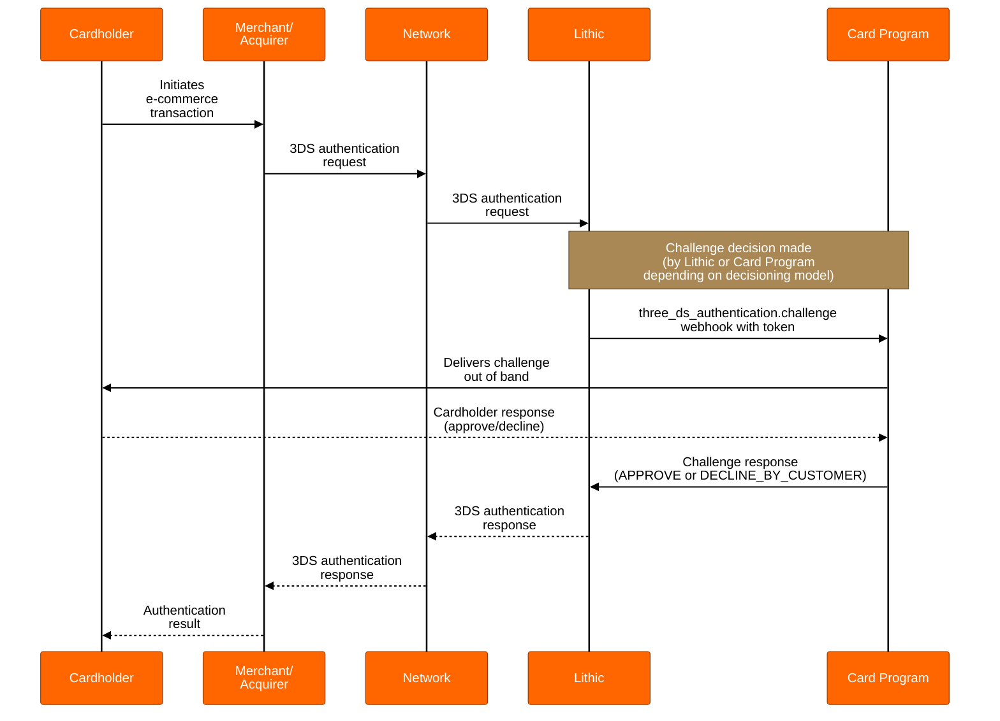

# Customer Orchestration - 3DS Challenges

Learn about how you can expand your 3DS authentication flow to include challenges

## Overview

3DS Customer Orchestration enables challenge flows where your organization maintains full control over the challenge delivery and verification process. When a transaction requires additional cardholder verification, your organization is responsible for delivering the challenge through your chosen method (SMS, push notification, email, biometric, etc.), collecting the cardholder's response, and communicating the result back to Lithic.

This orchestration model provides maximum flexibility in challenge methods and user experience design while requiring your organization to build and maintain the complete challenge infrastructure. Customer Orchestration works with both [Lithic Decisioning](https://docs.lithic.com/docs/3ds-decisioning) and [Customer Decisioning](https://docs.lithic.com/docs/3ds-customer-decisioning) models—the choice of who decides to challenge (decisioning model) is independent from who delivers the challenge (orchestration model).

## How Customer Challenge Orchestration Works

When a cardholder is challenged as part of a 3DS authentication:

1. A challenge decision is made (by either Lithic's model or your organization's decisioning logic, depending on your configuration)
2. Lithic sends a `three_ds_authentication.challenge` webhook to your organization containing challenge details
3. Your organization delivers the challenge to the cardholder through your chosen channel
4. Your organization collects the cardholder's response (approve/decline)
5. Your organization sends the challenge result to Lithic via the challenge response endpoint
6. Lithic forwards the result through the network to complete the authentication

Your organization must complete this entire process before the challenge expiration time, typically within 10 minutes.

## Technical Requirements

### Challenge Event Webhook

When a challenge is initiated, Lithic sends the `three_ds_authentication.challenge` webhook containing:

* `authentication_object`: Information about the ongoing 3DS authentication, including the `token` required for responding with challenge results
* `start_time`: When the challenge was initiated
* `expiry_time`: Deadline for responding with challenge results (typically 10 minutes from start)

Your organization must subscribe to this webhook event to receive challenge notifications. See the [3DS Challenge Webhook specification](https://docs.lithic.com/reference/post_three-ds-authentication-challenge) for complete details.

### Challenge Response Requirements

After collecting the cardholder's response, your organization must send the result to Lithic using the challenge response endpoint with one of these values:

* `APPROVE`: Cardholder verified and approved the transaction
* `DECLINE_BY_CUSTOMER`: Cardholder declined the transaction or failed verification

The response must include the authentication token from the challenge webhook and be submitted before the expiry time. See the [3DS Challenge Response API](https://docs.lithic.com/reference/post_v1-three-ds-decisioning-challenge-response) for implementation details.

## Challenge User Interface

As with Lithic Orchestration, the challenge UI displayed to the cardholder during checkout is served by Lithic. Card programs have control in defining the templates for the Challenge UI to match your brand identity, including your logo, colors, and text, while adhering to the information architecture prescribed by the 3DS standard. To set up your challenge UI, work with your Implementation Manager or Customer Success Manager.

### Out-of-Band Messaging

In the Customer Orchestration model, your organization delivers the actual challenge to the cardholder out-of-band (via push notification, SMS, email, or another channel of your choosing). Because the cardholder receives and responds to the challenge outside of the merchant's checkout flow, it is important that your out-of-band messaging instructs the cardholder to return to the merchant's checkout page after completing the challenge. The 3DS authentication cannot finalize until the merchant's checkout flow receives the result, so if the cardholder does not return, the challenge may time out and be recorded as abandoned, even if the cardholder approved it on your platform.

## Response Guidelines

### Challenge Expiration

By default, cardholder challenges will only last for ten minutes. This window denotes the time between when the Challenge Request is sent by the Directory Server to when the Result Request is received by the Directory Server, including the time for all intermediary communication. The precise time a given challenge will expire is noted in the `three_ds_authentication.challenge` webhook as the `expiry_time`.

Responses not received within the live window will count against abandonment metrics.

### Challenge Abandonment

It is important to be aware that card networks may enforce data integrity metrics which measure challenge abandonment. Challenge abandonment is recorded when an appropriate approval response is not received by the Directory Server prior to challenge expiry. Abandonment causes can include, but are not limited to:

* Technical issues preventing the cardholder from receiving the challenge
* Inability for the cardholder to complete the challenge successfully
* No cardholder response
* Cardholder cancelling the transaction (decline response)

In the case of Mastercard, challenge flow abandonment is monitored via MC Data Integrity Monitoring Program Chapter 14, Edit 8. At the time of writing, the current abandonment rate threshold for the Mastercard Data Integrity Monitoring Program is set at 90%. As a result, penalties may be assessed by the payment network when abandonments exceed 10% of challenges.

> 📘
>
> Enforced Data Integrity thresholds may change in the future. As always, please review the most up-to-date network documentation before making decisions about your program.

## API References

* [3DS Decisioning Request](https://docs.lithic.com/reference/post_three-ds-decisioning)
* [3DS Challenge Webhook](https://docs.lithic.com/reference/post_three-ds-authentication-challenge)
* [3DS Challenge Response](https://docs.lithic.com/reference/post_v1-three-ds-decisioning-challenge-response)