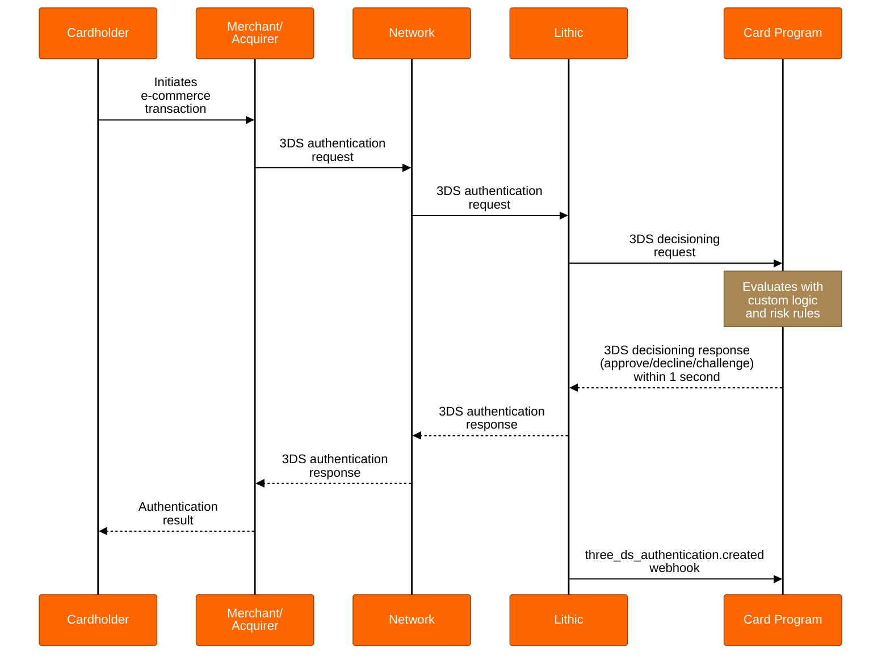

# 3DS Customer Decisioning

## Overview

3DS Customer Decisioning provides your organization with complete control over 3DS authentication decisions. Upon receiving a 3DS authentication request, Lithic forwards detailed transaction data directly to your organization's endpoint. Your system evaluates the risk associated with the transaction in real-time and responds with a decision to approve, decline, or challenge the authentication request.

This model enables your organization to integrate proprietary risk management rules, custom business logic, and internal data sources into the authentication process. Unlike [Lithic Decisioning](https://docs.lithic.com/docs/3ds-decisioning), where Lithic's fraud model makes all decisions, Customer Decisioning puts your organization in full control of authentication outcomes while Lithic manages the network integration and technical infrastructure.

## How Customer Decisioning Works

When a cardholder initiates an e-commerce transaction at a 3DS-enabled merchant:

1. The merchant's acquirer sends a 3DS authentication request through the card network to Lithic
2. Lithic packages the authentication data and sends a real-time request to your registered responder endpoint
3. Your system evaluates the transaction using your custom logic and risk rules
4. Your endpoint responds within 1 second with an authentication decision
5. Lithic forwards your decision through the network to the merchant
6. Lithic simultaneously sends a `three_ds_authentication.created` webhook to your organization with complete authentication details

## Technical Requirements

### Response Time Requirement

Your responder endpoint must respond to authentication requests within 1 second. If your endpoint fails to respond within this timeframe, Lithic will decision the authentication on your behalf. The subsequent webhook will show `decision_made_by` as `LITHIC_RULES` rather than `CUSTOMER_ENDPOINT`.

### Decisioning Request and Response

Your responder endpoint receives a decisioning request containing comprehensive authentication data. The request includes transaction details, merchant information, device data, and network risk indicators. Your system must respond with one of three decisions:

* `APPROVE`: Allow the authentication to proceed
* `DECLINE`: Reject the authentication
* `CHALLENGE_REQUESTED`: Initiate a challenge flow (if challenges are enabled)

For complete request and response specifications, see the [3DS Decisioning API documentation](https://docs.lithic.com/reference/post_three-ds-decisioning).

### Setting Up Your Responder

To implement Customer Decisioning:

1. **Create a responder endpoint**: Use the [Create Responder Endpoint API](https://docs.lithic.com/reference/postresponderendpoints) to register your endpoint URL
2. **Implement HMAC security**: Retrieve your HMAC secret using the [Get 3DS Decision Secret API](https://docs.lithic.com/reference/getthreedsdecisioningsecret) and implement request verification
3. **Handle authentication requests**: Process incoming requests and respond within 1 second
4. **Test in sandbox**: Validate your implementation before production deployment

### Additional Decisioning Scenarios

In additional to the typical authentication flow, there are several additional decisioning scenarios to consider and accomodate:

**Non-decisionable Events**: Certain 3DS event types, such as `DATA_SHARE_ONLY` authentications, are informational only and do not route to your decisioning endpoint. These events are delivered via webhooks for use in authorization decisioning.

**Override Scenarios**: Lithic may override your authentication decisions to protect the payment ecosystem in cases such as detected card testing attacks or network security alerts.

## Network Compliance

While Customer Decisioning provides full control over authentication decisions, your organization must maintain compliance with network requirements:

**Mastercard Authentication Rate**: Mastercard mandates a minimum 70% approval rate for frictionless 3DS authentications (MC Data Integrity Monitoring Program - Edit 1). Your decisioning logic must maintain required approval thresholds. Network penalties for non-compliance are passed through to your organization.

## Integration with Authorization Decisioning

The `cardholder_authentication` object in authorization requests includes:

* `liability_shift`: Indicates whether fraud liability has shifted to your organization
* `authentication_result`: Your authentication decision outcome
* `decision_made_by`: Confirms whether the decision came from `CUSTOMER_ENDPOINT` or `LITHIC_RULES`
* `three_ds_authentication_token`: Correlates the authentication with its authorization

When liability shifts to your organization following a successful 3DS authentication, you forfeit chargeback rights for fraud claims on that transaction.

## Next Steps

Contact your Implementation Manager or Customer Success Manager to configure 3DS Customer Decisioning for your card program.

For programs interested in adding challenge capabilities to Customer Decisioning, you can choose between [3DS Lithic Orchestration](https://docs.lithic.com/docs/challenge-flow-lithic-decisioning) or [3DS Customer Orchestration](https://docs.lithic.com/docs/3ds-challenge-flow) based on your infrastructure capabilities and control requirements.