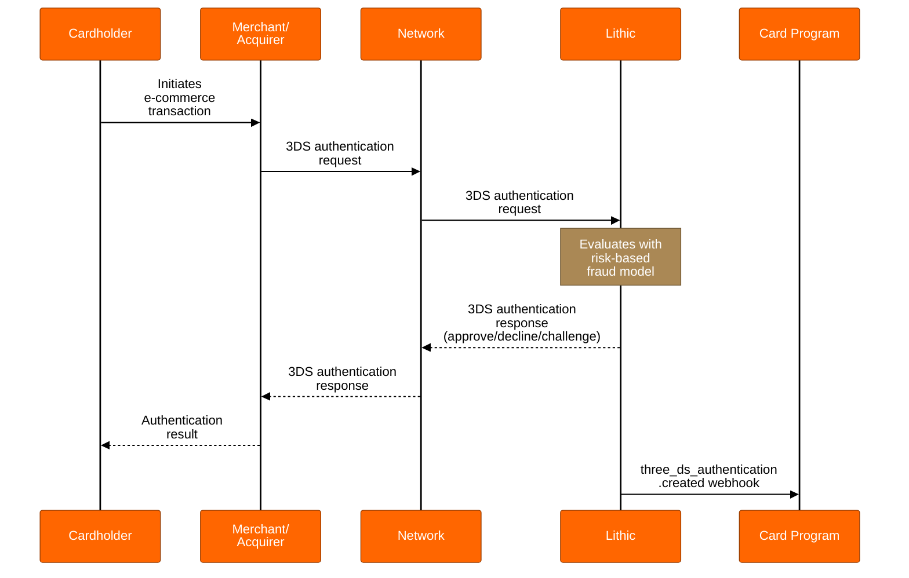

# 3DS Lithic Decisioning

Learn about leveraging Lithic's 3DS decisioning model to participate in 3DS.

## Overview

3DS Lithic Decisioning delegates authentication decisions to Lithic's automated risk model. When a 3DS authentication request arrives for a card in your program, Lithic evaluates the transaction against proprietary risk signals and responds automatically on your organization's behalf. This model requires no real-time integration or decisioning infrastructure from your organization.

Lithic's decisioning model analyzes network-provided authentication data to determine whether to approve or decline each authentication request. The model continuously evolves based on fraud trends across Lithic's network while maintaining compliance with network-mandated approval thresholds.

## How Lithic Decisioning Works

When a cardholder initiates an e-commerce transaction at a 3DS-enabled merchant:

1. The merchant's acquirer sends a 3DS authentication request to Lithic's Access Control Server (ACS)
2. Lithic's fraud detection model evaluates the authentication data against risk indicators
3. The model generates an approve or decline (or challenge, if enabled) decision
4. Lithic returns the authentication response to the merchant through the network
5. Lithic simultaneously sends a `three_ds_authentication.created` webhook to your organization containing the authentication details and outcome

Your organization receives comprehensive authentication data through webhooks but does not participate in the real-time decisioning process. This separation allows you to monitor authentication patterns and outcomes without maintaining high-availability infrastructure.

## Lithic 3DS Model

Lithic's decisioning model evaluates 3DS authentication requests using data that extends beyond standard network-provided signals. The model analyzes dozens of attributes and weighs them into a combined risk score to determine whether to approve, decline, or challenge an authentication. In additional to typical checks for high-risk countries, currencies, and merchants, the Lithic decisioning model utilizes:

**Account Holder Matching**

* For each authentication request, Lithic retrieves account holder data from KYC records and compares it against the shopper information included in the 3DS request. The model performs name and email matching to identify discrepancies between the shopper conducting the transaction and the verified account holder on file.

**IP Intelligence**

* Lithic resolves IP metadata to identify potentially suspicious authentication attempts. The model flags IPs based on usage type (such as VPNs or proxies) and geographic mismatches between the IP location and other transaction signals.

**Device Data**

* For app-based purchases, Lithic parses and evaluates detailed device data included in the authentication request. This includes locale, time zone, screen resolution, and geographic coordinates from the user's mobile device when available.

The attributes evaluated by the model are weighted based on fraud patterns derived from fraud and chargeback reports received from the card networks. Lithic continuously refines these weights and adds additional attributes as new data becomes available.

## Authentication Data Access

While Lithic makes the authentication decisions, your organization receives detailed transaction data through the `three_ds_authentication.created` webhook. This data includes transaction details, merchant information, risk indicators, and authentication outcomes that can inform your subsequent authorization decisioning.

For the complete list of available fields and their descriptions, see the [3DS Authentication Created webhook specification](https://docs.lithic.com/reference/post_three-ds-authentication-created).

## Augmenting Decisions with 3DS Auth Rules

Organizations can make Lithic's authentication decisions more restrictive by implementing 3DS Auth Rules. These rules evaluate authentication attributes and can decline transactions that Lithic's model would approve, providing an additional layer of custom control without requiring a full Customer Decisioning implementation.

Lithic applies the strictest decision across all evaluation models. If your 3DS auth rule declines an authentication that Lithic's model would have otherwise approved, the authentication will be declined. However, because the strictest decision is applied, 3DS auth rules cannot approve authentications that Lithic's model has declined.

3DS Auth Rules can target various authentication attributes including merchant category codes, countries, currencies, transaction amounts, and risk scores. For the complete list of targetable attributes and rule configuration options, see the [Auth Rules API specification](https://docs.lithic.com/reference/post_v2-auth-rules).

## Network Compliance

Lithic's decisioning model maintains compliance with network-mandated approval thresholds while protecting against fraud. Mastercard requires a minimum 70% approval rate for frictionless 3DS authentications (MC Data Integrity Monitoring Program (Edit 1)). Lithic's model is calibrated to meet this threshold while maximizing fraud prevention.

In certain circumstances, Lithic may decline authentications to protect the payment ecosystem, such as during detected card testing attacks or exceptional merchant fraud events.

## Integration with Authorization Decisioning

The authentication data provided from the 3DS authentication process can be used to make better decisions during the transaction authorization process. The `cardholder_authentication` object in authorization requests includes:

* `liability_shift`: Indicates whether fraud liability has shifted from the merchant to your organization
* `authentication_result`: The outcome of the 3DS authentication (approve/decline)
* `decision_made_by`: Confirms the decision was made by `LITHIC_RULES`
* `three_ds_authentication_token`: Correlates the authentication with its subsequent authorization

The full `cardholder_authentication` object can be found in the [ASA request API specification](https://docs.lithic.com/reference/post_asa-request).

When liability shifts to your organization following a successful 3DS authentication, you forfeit chargeback rights for fraud claims on that transaction. Lithic advises that your authorization logic should incorporate this liability shift signal along with the authentication outcome to make informed approval decisions.

## Next Steps

Contact your Implementation Manager or Customer Success Manager to configure 3DS Lithic Decisioning for your card program.

For programs requiring more control over authentication decisions or the ability to implement custom risk rules, see [3DS Customer Decisioning](https://docs.lithic.com/docs/3ds-customer-decisioning). For programs interested in adding challenge capabilities, see [3DS Challenge Flows](https://docs.lithic.com/docs/3ds-challenges).