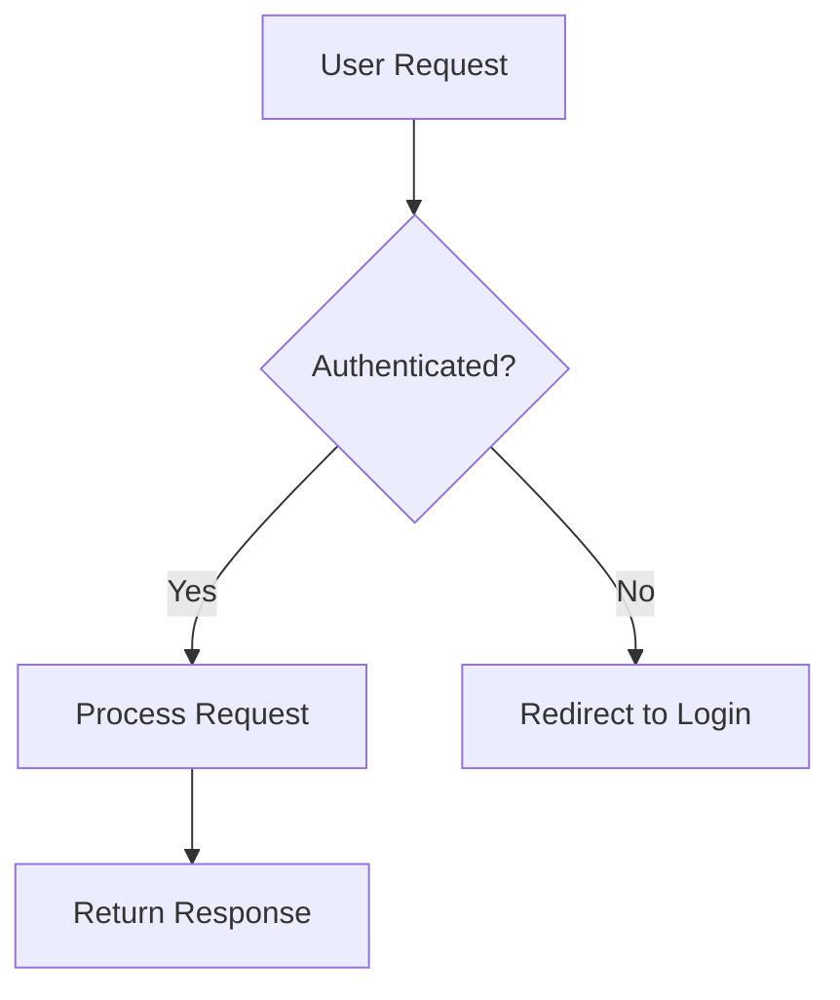
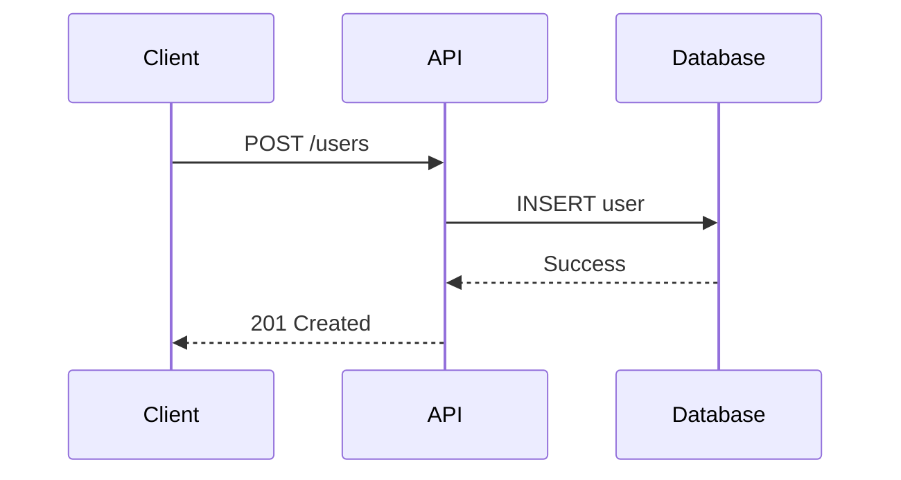

# Documentation.AI — Complete Component Migration Reference

> **Source:** Every component, syntax example, and attribute in this document is sourced exclusively from the official Documentation.AI docs at [documentation.ai/docs/components](https://documentation.ai/docs/components/heading-and-text).
>
> **Last verified:** February 17, 2026

---

## File Format

Documentation.AI uses **MDX** (Markdown + JSX components). All files are `.mdx`. Both the **Web Editor** (visual, slash-menu based) and the **Code Editor** (direct MDX) produce the same underlying syntax.

---

## Complete Component List (16 Components)

| # | Component | MDX Tag(s) | Docs URL |
|---|-----------|-----------|----------|
| 1 | Headings and Text | `##`, `###`, `####`, `**`, `*`, `~~`, `` ` ``, `<kbd>`, `<br />` | [/heading-and-text](https://documentation.ai/docs/components/heading-and-text) |
| 2 | Lists and Tables | `-`, `1.`, `\| \|` (Markdown) | [/lists-and-tables](https://documentation.ai/docs/components/lists-and-tables) |
| 3 | Card | `<Card>`, `<Columns>` (for card grids) | [/card](https://documentation.ai/docs/components/card) |
| 4 | Columns | `<Columns>` | [/columns](https://documentation.ai/docs/components/columns) |
| 5 | Images | `<Image>` | [/images](https://documentation.ai/docs/components/images) |
| 6 | Videos and Iframes | `<Video>`, `<Iframe>` | [/videos-and-iframes](https://documentation.ai/docs/components/videos-and-iframes) |
| 7 | Code and Groups | Fenced code blocks, `<CodeGroup>` | [/code-blocks-and-groups](https://documentation.ai/docs/components/code-blocks-and-groups) |
| 8 | Mermaid Diagrams | `` ```mermaid `` (fenced code block) | [/mermaid](https://documentation.ai/docs/components/mermaid) |
| 9 | Callout | `<Callout>` | [/callout](https://documentation.ai/docs/components/callout) |
| 10 | Expandables | `<Expandable>`, `<ExpandableGroup>` | [/expandables](https://documentation.ai/docs/components/expandables) |
| 11 | Steps | `<Steps>`, `<Step>` | [/steps](https://documentation.ai/docs/components/steps) |
| 12 | Tabs | `<Tabs>`, `<Tab>` | [/tabs](https://documentation.ai/docs/components/tabs) |
| 13 | Update | `<Update>` | [/update](https://documentation.ai/docs/components/update) |
| 14 | Param Field | `<ParamField>` | [/paramfield](https://documentation.ai/docs/components/paramfield) |
| 15 | Response Field | `<ResponseField>` | [/responsefield](https://documentation.ai/docs/components/responsefield) |
| 16 | API Components | `<Request>`, `<Response>` | [/api-components](https://documentation.ai/docs/components/api-components) |

---

## 1. Headings and Text

The page title renders as H1 via frontmatter `title`. Body content starts at `##`.

### MDX Syntax

```mdx
## Section title
### Subsection
#### Detail (deepest recommended level)
```

### Inline Formatting

```mdx
**Bold** text for strong emphasis.
*Italic* text for subtle emphasis.
~~Strikethrough~~ for removed or deprecated content.
Use `inline code` for code-like terms, HTTP methods, or field names.
Press <kbd>Ctrl</kbd> + <kbd>C</kbd> to copy.
```

### Links

```mdx
<!-- Internal (absolute path from docs root) -->
[Quickstart](/getting-started/quickstart)

<!-- External -->
[Documentation.AI](https://documentation.ai/)

<!-- Combined with emphasis -->
See the **[Callout component](/components/callout)** for highlighting important notes.
```

### Line Breaks

```mdx
First line with an intentional break. \
Second line continues the same paragraph.

<!-- Or use explicit <br /> -->
Run these commands in order:<br />
1. Install dependencies<br />
2. Start the dev server
```

---

## 2. Lists and Tables

### Ordered List

```mdx
1. First item
2. Second item
3. Third item
```

### Unordered List

```mdx
- First item
- Second item
- Third item
```

### Nested Lists

```mdx
1. First item
   - Nested unordered item
   - Another nested item
2. Second item
   1. Nested ordered item
   2. Another nested ordered item
```

### Tables

```mdx
| Feature        | Description         | Status      |
| -------------- | ------------------- | ----------- |
| Authentication | User login system   | Complete    |
| Dashboard      | Main user interface | In progress |
```

**Column alignment:**

```mdx
| Name  | Role      | Status   |
| :---- | :-------: | -------: |
| Alice | Developer | Active   |
```

- `:----` = left-aligned
- `:----:` = center-aligned
- `----:` = right-aligned

---

## 3. Card

### Single Card

```mdx
<Card title="Quickstart" icon="zap" href="/getting-started/quickstart">
  Get up and running with Documentation.AI in a few minutes.
</Card>
```

### All Card Attributes

| Attribute | Type | Description |
|-----------|------|-------------|
| `title` | string | Main heading on the card |
| `href` | string | Link destination (internal path or external URL) |
| `icon` | string | Lucide icon name (e.g. `"zap"`, `"book-open"`, `"code"`) |
| `image` | string | Optional header image URL |
| `cta` | string | Call-to-action text (e.g. `"Learn more"`) |
| `horizontal` | boolean | Toggle horizontal (side-by-side) layout |
| `target` | string | `"_self"` (default) or `"_blank"` (new tab) |

### Card Grid (using Columns)

```mdx
<Columns cols={3}>
  <Card title="Get started" icon="book-open" href="/getting-started/introduction">
    Learn the core concepts.
  </Card>
  <Card title="Write docs" icon="code" href="/write-and-publish/code-editor">
    Author documentation using MDX.
  </Card>
  <Card title="Add media" icon="image" href="/components/images">
    Use images and screenshots.
  </Card>
</Columns>
```

---

## 4. Columns

Responsive grid layout wrapper. Does not alter content — only controls placement.

```mdx
<Columns cols={2}>
  <!-- Any child components: Cards, Images, Callouts, text, etc. -->
</Columns>
```

### Attributes

| Attribute | Type | Values | Description |
|-----------|------|--------|-------------|
| `cols` | number | `2`, `3`, or `4` | Number of columns in the grid |

Columns automatically collapse to single-column on mobile.

---

## 5. Images

### MDX Syntax

```mdx
<Image
  src="https://your-cdn.com/image.png"
  alt="Description of the image"
  width="800"
  height="600"
/>
```

### Attributes

| Attribute | Type | Required | Description |
|-----------|------|----------|-------------|
| `src` | string | Yes | Absolute image URL (prefer CDN URLs) |
| `alt` | string | Yes | Descriptive text for accessibility/SEO |
| `width` | string | No | Width in pixels |
| `height` | string | No | Height in pixels |
| `caption` | string | No | Text displayed below the image |

### With Caption

```mdx
<Image
  src="https://your-cdn.com/screenshot.png"
  alt="Dashboard overview showing analytics"
  caption="The main analytics dashboard"
  width="800"
  height="600"
/>
```

---

## 6. Videos and Iframes

### Video — Iframe Mode (YouTube, Vimeo, Loom)

```mdx
<Video
  src="https://www.youtube.com/embed/Reu01KxMSF0"
  title="Feature overview video"
  width="672"
  height="378"
  allow-full-screen="true"
  style="width: 100%; max-width: 672px; height: auto;"
/>
```

### Video — HTML5 Mode (Self-hosted MP4)

```mdx
<Video
  src="https://example.com/video/feature-walkthrough.mp4"
  width="672"
  height="378"
  controls="true"
  poster="https://example.com/video/poster.jpg"
  preload="metadata"
  style="width: 100%; max-width: 672px; height: auto;"
/>
```

### Video Attributes (Iframe Mode)

| Attribute | Type | Description |
|-----------|------|-------------|
| `src` | string | Video embed URL (required) |
| `title` | string | Accessible title for screen readers |
| `width` / `height` | string | Player dimensions in pixels |
| `allow-full-screen` | boolean | Allow fullscreen playback |
| `priority` | boolean | Load immediately instead of lazy loading |
| `style` | string | Inline CSS for sizing/alignment |

### Video Attributes (HTML5 Mode)

| Attribute | Type | Description |
|-----------|------|-------------|
| `controls` | boolean | Show video controls (default: `true`) |
| `autoplay` | boolean | Start playing on page load |
| `muted` | boolean | Start muted (often required for autoplay) |
| `loop` | boolean | Loop playback |
| `poster` | string | Poster image shown before playback |
| `preload` | string | `"none"`, `"metadata"`, or `"auto"` |

### Iframe (External Embeds)

```mdx
<Iframe
  src="https://app.example.com/embed/dashboard"
  title="Embedded dashboard"
  width="100%"
  height="500"
/>
```

---

## 7. Code Blocks and Code Groups

### Single Code Block

````mdx
```typescript
const apiCall = async () => {
  const response = await fetch("/api/docs");
  return response.json();
};
```
````

### Code Block with Line Highlighting

````mdx
```javascript highlight="1-2,5"
const greeting = "Hello, World!";
function sayHello() {
  console.log(greeting);
}
sayHello();
```
````

### Code Block with Line Focus

````mdx
```javascript focus="2,4-5"
const greeting = "Hello, World!";
function sayHello() {
  console.log(greeting);
}
sayHello();
```
````

### Code Block with Line Numbers

````mdx
```typescript highlight="1,3" show-lines="true"
interface User {
  name: string;
  age: number;
}
```
````

### Code Block with Line Wrapping

````mdx
```typescript wrap="true"
const longLine = "This is a very long line of code that would normally require horizontal scrolling...";
```
````

### Code Block Attributes

| Attribute | Type | Description |
|-----------|------|-------------|
| `highlight` | string | Line ranges to highlight, e.g. `"1-2,5"` |
| `focus` | string | Lines to focus (dims others), e.g. `"2,4-5"` |
| `show-lines` | string | Show line numbers: `"true"` |
| `wrap` | boolean | Wrap long lines instead of scrolling |

### CodeGroup (Tabbed Multi-Language)

```mdx
<CodeGroup tabs="TypeScript,Python,Bash">
```typescript
const response = await fetch("/api/docs", {
  method: "POST",
  headers: { "Content-Type": "application/json" },
  body: JSON.stringify({ title: "Getting Started" })
});
```

```python
import requests

response = requests.post(
  "https://api.example.com/docs",
  json={"title": "Getting Started"}
)
```

```bash
curl -X POST https://api.example.com/docs \
  -H "Content-Type: application/json" \
  -d '{"title": "Getting Started"}'
```
</CodeGroup>
```

### CodeGroup Attributes

| Attribute | Type | Description |
|-----------|------|-------------|
| `tabs` | string | Comma-separated tab labels, e.g. `"TypeScript,Python,Bash"`. If omitted, language names are used. |

---

## 8. Mermaid Diagrams

Use a fenced code block with language `mermaid`. Diagrams render with interactive zoom controls and fullscreen support.

### Flowchart

````mdx

````

### Sequence Diagram

````mdx

````

### Supported Diagram Types

- Flowcharts (`graph TD` / `graph LR`)
- Sequence diagrams (`sequenceDiagram`)
- Class diagrams (`classDiagram`)
- State diagrams (`stateDiagram-v2`)
- Entity-relationship diagrams (`erDiagram`)

---

## 9. Callout

### Basic Syntax

```mdx
<Callout kind="info">
  This is an informational callout.
</Callout>
```

### All 5 Callout Kinds

```mdx
<Callout kind="info">
  Configure your API key in the settings before making requests.
</Callout>

<Callout kind="tip">
  Use environment variables to store sensitive configuration like API keys.
</Callout>

<Callout kind="success">
  Your documentation has been successfully deployed and is live.
</Callout>

<Callout kind="alert">
  This action cannot be undone. Make sure you have a backup before proceeding.
</Callout>

<Callout kind="danger">
  Deleting this workspace will permanently remove all documentation and cannot be recovered.
</Callout>
```

### Attributes

| Attribute | Type | Values | Description |
|-----------|------|--------|-------------|
| `kind` | string | `"info"` (default), `"tip"`, `"success"`, `"alert"`, `"danger"` | Visual style and icon |
| `collapsed` | string | `"true"` / `"false"` | Start collapsed (hidden until reader expands) |

### Collapsed Callout

```mdx
<Callout kind="info" collapsed="true">
  This is an optional deep-dive explanation that starts collapsed.
</Callout>
```

---

## 10. Expandables

### Single Expandable

```mdx
<Expandable title="Click to expand" default-open="false">
  Add your content here...
</Expandable>
```

### Expandable with Rich Content

```mdx
<Expandable title="API configuration" default-open="false">
## Environment variables

Set these variables in your `.env` file:

- `API_KEY` - Your API authentication key
- `API_URL` - Base URL for API calls

```bash
API_KEY=your-secret-key
API_URL=https://api.example.com
```

<Callout kind="danger">
  Never commit API keys to version control.
</Callout>
</Expandable>
```

### ExpandableGroup (FAQ Style)

```mdx
<ExpandableGroup>
  <Expandable title="Installation" default-open="true">
    Install the package:

    ```bash
    npm install documentation-ai
    ```
  </Expandable>

  <Expandable title="Configuration" default-open="false">
    Create a config file in your project root.
  </Expandable>

  <Expandable title="Deployment" default-open="false">
    Push your changes to deploy.
  </Expandable>
</ExpandableGroup>
```

### Attributes

| Attribute | Type | Description |
|-----------|------|-------------|
| `title` | string | Text shown in the clickable header |
| `default-open` | string | `"true"` to start open, `"false"` to start closed (default: `"false"`) |

---

## 11. Steps

### Basic Steps with Auto-Numbering

```mdx
<Steps>
  <Step title="Create your account">
    Sign up with your email address and create a secure password.
  </Step>
  <Step title="Verify your email">
    Check your inbox for the verification link and click to confirm.
  </Step>
  <Step title="Start building">
    Create your first documentation project.
  </Step>
</Steps>
```

### Steps with Icons (Replaces Numbers)

```mdx
<Steps>
  <Step title="Install dependencies" icon="download">
    Run the installation command:

    ```bash
    npm install documentation-ai
    ```
  </Step>
  <Step title="Configure settings" icon="settings">
    Create a config file:

    ```javascript
    module.exports = {
      apiKey: process.env.DOC_AI_KEY
    }
    ```
  </Step>
  <Step title="Deploy documentation" icon="rocket">
    Push your changes:

    ```bash
    npm run deploy
    ```
  </Step>
</Steps>
```

### Step Attributes

| Attribute | Type | Description |
|-----------|------|-------------|
| `title` | string | Step title text |
| `icon` | string | Lucide icon name (replaces the step number). E.g. `"download"`, `"settings"`, `"rocket"`, `"check"` |
| `heading-level` | string | `"p"` (default), `"h2"`, or `"h3"` — controls HTML heading level for SEO |

---

## 12. Tabs

### Basic Tabs

```mdx
<Tabs>
  <Tab title="JavaScript">
    Content for JavaScript tab
  </Tab>
  <Tab title="Python">
    Content for Python tab
  </Tab>
</Tabs>
```

### Tabs with Icons

```mdx
<Tabs>
  <Tab title="macOS" icon="apple">
    Install using Homebrew:

    ```bash
    brew install documentation-ai
    ```
  </Tab>
  <Tab title="Windows" icon="monitor">
    Download the Windows installer:

    ```bash
    winget install documentation-ai
    ```
  </Tab>
  <Tab title="Linux" icon="terminal">
    Use your package manager:

    ```bash
    sudo apt install documentation-ai
    ```
  </Tab>
</Tabs>
```

### Tab Attributes

| Attribute | Type | Description |
|-----------|------|-------------|
| `title` | string | Tab label text |
| `icon` | string | Lucide icon name (e.g. `"book-open"`, `"download"`, `"settings"`, `"rocket"`) |

---

## 13. Update (Changelogs)

### Basic Update

```mdx
<Update label="2024-10-15" description="v1.2.0">
  Released new analytics dashboard with real-time metrics and custom reporting.
</Update>
```

### Update with Tags

```mdx
<Update
  label="2024-10-20"
  description="v2.0.0"
  tags={["breaking", "security", "performance"]}
>
  ### Major release

  This release includes breaking changes and performance improvements.

  - Updated API authentication flow requiring new credentials
  - Optimized database queries for 3x faster response times
  - Enhanced security with improved encryption standards
</Update>
```

### Attributes

| Attribute | Type | Description |
|-----------|------|-------------|
| `label` | string | Main tag on the left (date, version number, etc.) |
| `description` | string | Short note under the label (e.g. `"v2.3.0"`, `"Patch"`) |
| `tags` | array | Optional category tags, e.g. `{["breaking", "security"]}` |

Stack multiple `<Update>` blocks sequentially to build a changelog timeline.

---

## 14. Param Field (API Parameters)

### Basic Syntax

```mdx
<ParamField path="id" param-type="string" required="true">
  Unique identifier for the resource.
</ParamField>
```

### Location Variants

```mdx
<!-- Path parameter -->
<ParamField path="id" param-type="string" required="true">
  Resource identifier in the URL path.
</ParamField>

<!-- Query parameter -->
<ParamField query="limit" param-type="integer">
  Maximum number of results to return.
</ParamField>

<!-- Header parameter -->
<ParamField header="Authorization" param-type="string" required="true">
  Bearer token for authentication.
</ParamField>

<!-- Body parameter -->
<ParamField body="email" param-type="string" required="true">
  User email address.
</ParamField>
```

### Deprecated Parameter

```mdx
<ParamField query="api_key" param-type="string" deprecated="true">
  Legacy API key. Use Authorization header instead.
</ParamField>
```

### Hide Location Badge

```mdx
<ParamField query="token" param-type="string" show-location="false" required="true">
  Authentication token without location badge.
</ParamField>
```

### Attributes

| Attribute | Type | Description |
|-----------|------|-------------|
| `path` | string | Parameter name for URL path params |
| `query` | string | Parameter name for query string params |
| `header` | string | Parameter name for HTTP headers |
| `body` | string | Parameter name for request body fields |
| `param-type` | string | Data type: `"string"`, `"integer"`, `"boolean"`, `"object"`, `"array"`, etc. |
| `required` | string | `"true"` to mark required (default: `"false"`) |
| `deprecated` | string | `"true"` to show deprecated badge (default: `"false"`) |
| `show-location` | string | `"false"` to hide the location badge |

> **Note:** Use exactly ONE of `path`, `query`, `header`, or `body` per ParamField — this determines both the parameter name and the location badge.

---

## 15. Response Field (API Responses)

### Basic Syntax

```mdx
<ResponseField name="id" field-type="string" required="true">
  Unique identifier for the resource.
</ResponseField>
```

### Examples

```mdx
<!-- Required field -->
<ResponseField name="id" field-type="string" required="true">
  Unique identifier for the resource.
</ResponseField>

<!-- Optional field -->
<ResponseField name="description" field-type="string">
  Optional description text for the resource.
</ResponseField>

<!-- Deprecated field -->
<ResponseField name="legacy_id" field-type="integer" deprecated="true">
  Deprecated legacy identifier. Use `id` instead.
</ResponseField>

<!-- Complex type -->
<ResponseField name="user" field-type="object" required="true">
  User object containing profile information and preferences.
</ResponseField>
```

### Attributes

| Attribute | Type | Description |
|-----------|------|-------------|
| `name` | string | Field name in the response (default: `"response"`) |
| `field-type` | string | Data type: `"string"`, `"integer"`, `"boolean"`, `"object"`, `"array"`, etc. |
| `required` | string | `"true"` for required fields (default: `"false"`) |
| `deprecated` | string | `"true"` to mark as deprecated (default: `"false"`) |

---

## 16. API Components (Request & Response Sidebar)

Creates a two-column layout: main docs on the left, code examples in a sticky right sidebar on desktop.

### Request Component

```mdx
<Request>
```javascript tab="JavaScript"
const response = await fetch('/api/docs', {
  method: 'POST',
  headers: {
    'Authorization': 'Bearer TOKEN',
    'Content-Type': 'application/json'
  },
  body: JSON.stringify({ title: 'Getting Started' })
});
```

```bash tab="cURL"
curl -X POST https://api.example.com/docs \
  -H "Authorization: Bearer TOKEN" \
  -H "Content-Type: application/json" \
  -d '{"title": "Getting Started"}'
```
</Request>
```

### Response Component

```mdx
<Response>
```json tab="200"
{
  "id": "doc-123",
  "title": "Getting Started",
  "status": "published",
  "created_at": "2024-01-15T10:30:00Z"
}
```

```json tab="404"
{
  "error": "Document not found",
  "code": "DOC_NOT_FOUND",
  "message": "The requested document does not exist"
}
```
</Response>
```

The `<Request>` and `<Response>` components function like sidebar-positioned `<CodeGroup>` blocks. Each fenced code block inside uses a `tab` attribute to label the tab.

---

## Migration Mapping: Common Platforms → Documentation.AI

### From ReadMe

| ReadMe Feature | Documentation.AI Equivalent |
|---------------|----------------------------|
| `> 📘 Info` (blockquote callout) | `<Callout kind="info">` |
| `> ⚠️ Warning` | `<Callout kind="alert">` |
| `> 🚧 Danger` | `<Callout kind="danger">` |
| `> 👍 Success` | `<Callout kind="success">` |
| Code tabs | `<CodeGroup tabs="...">` |
| `[block:parameters]` | `<ParamField>` for each parameter |
| Embed videos | `<Video src="...">` |
| Accordion / FAQ | `<Expandable>` / `<ExpandableGroup>` |

### From Mintlify

| Mintlify Component | Documentation.AI Equivalent |
|-------------------|----------------------------|
| `<Note>` | `<Callout kind="info">` |
| `<Tip>` | `<Callout kind="tip">` |
| `<Warning>` | `<Callout kind="alert">` |
| `<Info>` | `<Callout kind="info">` |
| `<CardGroup>` | `<Columns cols={N}>` with `<Card>` children |
| `<Card>` | `<Card>` (same concept, check attribute names) |
| `<CodeGroup>` | `<CodeGroup tabs="...">` |
| `<Accordion>` | `<Expandable>` |
| `<AccordionGroup>` | `<ExpandableGroup>` |
| `<Steps>` / `<Step>` | `<Steps>` / `<Step>` (same) |
| `<Tabs>` / `<Tab>` | `<Tabs>` / `<Tab>` (same) |
| `<ParamField>` | `<ParamField>` (check attribute differences: `type` → `param-type`) |
| `<ResponseField>` | `<ResponseField>` (check: `type` → `field-type`) |
| `<Frame>` | `<Image>` with `caption` |

### From GitBook

| GitBook Feature | Documentation.AI Equivalent |
|----------------|----------------------------|
| Hint blocks (info/warning/danger/success) | `<Callout kind="info/alert/danger/success">` |
| Expandable sections | `<Expandable>` |
| Tabs | `<Tabs>` / `<Tab>` |
| Embedded content | `<Video>` or `<Iframe>` |
| Card links | `<Card>` |
| API reference | `<ParamField>`, `<ResponseField>`, `<Request>`, `<Response>` |
| Code blocks | Fenced code blocks (same Markdown syntax) |

### From Docusaurus

| Docusaurus Feature | Documentation.AI Equivalent |
|-------------------|----------------------------|
| `:::note` / `:::tip` / `:::warning` / `:::danger` | `<Callout kind="info/tip/alert/danger">` |
| `<Tabs>` / `<TabItem>` | `<Tabs>` / `<Tab>` (change `<TabItem>` → `<Tab>`, `label` → `title`) |
| `<details>` | `<Expandable>` |
| Mermaid code blocks | `` ```mermaid `` (same) |
| MDX components | Rewrite to Documentation.AI components |

---

## Quick Reference: All MDX Tags

```
<Callout kind="info|tip|success|alert|danger" collapsed="true|false">
<Card title="" icon="" href="" image="" cta="" horizontal target="">
<Columns cols={2|3|4}>
<Image src="" alt="" width="" height="" caption="">
<Video src="" title="" width="" height="" controls="" autoplay="" muted="" loop="" poster="">
<Iframe src="" title="" width="" height="">
<CodeGroup tabs="Label1,Label2">
<Expandable title="" default-open="true|false">
<ExpandableGroup>
<Steps>
<Step title="" icon="" heading-level="p|h2|h3">
<Tabs>
<Tab title="" icon="">
<Update label="" description="" tags={["tag1","tag2"]}>
<ParamField path|query|header|body="" param-type="" required="" deprecated="" show-location="">
<ResponseField name="" field-type="" required="" deprecated="">
<Request>
<Response>
```

---

## Frontmatter Reference

Page-level metadata is set in YAML frontmatter at the top of each `.mdx` file. The `title` field renders as the page H1.

```yaml
---
title: "Page Title"
description: "Brief page description for SEO and AI summaries"
---
```

For full page configuration options, see the [Page Configuration docs](https://documentation.ai/docs/customize/page-configuration).

---

*This reference covers all 16 components documented at [documentation.ai/docs/components](https://documentation.ai/docs/components/heading-and-text) as of February 2026.*
