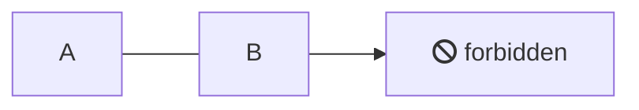

# Complete ReadMe.com migration inventory

ReadMe.com is a full-featured documentation platform built on MDX (Markdown + JSX) with interactive API reference, AI-powered search, bi-directional Git sync, and a React-based rendering engine. **This inventory catalogs every component, syntax element, feature, and capability** that must be replicated or replaced when migrating to documentation.ai. The platform spans 6 page types, 13+ built-in components, a custom component marketplace, a complete CSS variable system, and deep OpenAPI integration — all powered by the `@readme/markdown` npm package.

---

## 1. Built-in MDX and Markdown components

ReadMe provides **13 distinct content components** available through the WYSIWYG editor, slash commands, or raw MDX. Each renders with specific HTML structures and supports CSS customization.

### Callouts (blockquote-based)

Callouts use standard Markdown blockquotes with an emoji on the first line to set the theme:

```markdown
> 📘 Title Text
>
> Body content here. Supports **Markdown** formatting.
```

**Five theme types** with emoji-to-class mappings:

| Emoji | CSS Class | Alternate Emoji | Color |
|-------|-----------|-----------------|-------|
| 📘 | `.callout_info` | ℹ️ | Blue |
| 👍 | `.callout_okay` | ✅ | Green |
| 🚧 | `.callout_warn` | ⚠️ | Orange |
| ❗ | `.callout_error` | 🛑 | Red |
| Any other | `.callout_default` | — | Gray |

Each callout renders with a `theme` attribute set to its emoji, enabling per-emoji CSS targeting via `[theme='🎅']`. CSS variables per theme include `--text`, `--title`, `--background`, and `--border`. Custom icons can replace emoji using Font Awesome glyphs:

```css
.callout[theme='📷'] {
  --emoji: unset;
  --icon: '\f030';
  --icon-color: #c50a50;
  --icon-font: 'Font Awesome 6 Pro';
}
```

**Escaping callout rendering**: Bold the emoji (`> **👋** text`) to render as a plain blockquote.

### Code blocks

**Single code block** uses standard fenced syntax with language identifier:

````
```javascript
console.log('hello');
```
````

**Tabbed code blocks** are created by placing multiple fenced blocks with **no blank line** between them. Text after the language identifier becomes the tab label:

````
```javascript Tab A
console.log('Tab A');
```
```python Tab B
print("Tab B")
```
````

**CSS variables** for code blocks:
```css
.markdown-body {
  --md-code-background: #e3dcef;
  --md-code-text: #4a2b7b;
  --md-code-tabs: #c6b8dd;
  --md-code-radius: 4px;
}
```

**Supported languages** (50+ identifiers): ASP.NET, C, C++, C#, Clojure, CSS/Less/Sass/SCSS, cURL, D, Dart, Diff, Docker, Erlang, Go, GraphQL, Groovy, Handlebars, HTML/XML, HTTP, Java, JavaScript/CoffeeScript/Node, JSX, JSON, Julia, Kotlin, Liquid, Lua, Markdown, Mermaid, Objective-C, Objective-C++, OCaml, Perl, PHP, PowerShell, Python, R, Ruby, Rust, Scala, Shell/Bash/Zsh, Solidity, SQL (MySQL, PostgreSQL, SQLite, MSSQL, PL/SQL), Swift, TypeScript, YAML.

### Embeds

Two syntax forms for embedding external content:

**Markdown syntax** — standard link with `@embed` title:
```markdown
[Embed Title](https://youtu.be/abc123 "@embed")
```

**JSX component**:
```jsx
<Embed
  url="https://github.com/readmeio/api-explorer/pull/671"
  title="RDMD CSS theming adjustments"
  favicon="https://github.com/favicon.ico"
  image="https://avatars2.githubusercontent.com/u/6878153"
  html={false}
/>
```

Attributes: `url` (string), `title` (string), `favicon` (string), `image` (string), `html` (boolean — `false` renders as Embedly card, `true` renders as iframe). Supported providers include YouTube, GitHub (PRs/repos/issues), Codepen, NYTimes, and any oEmbed-compatible URL.

### Tables

Standard Markdown table syntax with column alignment via `:` in the separator row:

```markdown
| Left   | Center   | Right |
|:-------|:--------:|------:|
| L0     | **bold** | $1600 |
```

**CSS variables**:
```css
.markdown-body .rdmd-table {
  --table-text: black;
  --table-head: #5b1c9f;
  --table-head-text: white;
  --table-stripe: #f0eaf7;
  --table-edges: rgba(34, 5, 64, 0.5);
  --table-row: white;
}
```

### Images

```markdown

```

Images uploaded through the editor are hosted on `files.readme.io`. Click-to-expand/lightbox behavior is built in. The quoted string after the URL serves as caption. In MDX mode, JSX `` tags with camelCase attributes are supported.

### Mermaid diagrams

Fenced code block with `mermaid` language identifier:

````

````

All standard Mermaid.js diagram types are supported: flowcharts, sequence diagrams, state diagrams, pie charts, user journeys, Gantt charts, class diagrams, and more. Multiple mermaid blocks without blank lines render in a tabbed interface.

### Tabs

```jsx
<Tabs>
  <Tab title="First Tab">
    Content with **Markdown** support.
  </Tab>
  <Tab title="Second Tab">
    More content here.
  </Tab>
</Tabs>
```

The `<Tabs>` wrapper contains `<Tab>` children, each with a `title` attribute for the tab label.

### Accordion

```jsx
<Accordion title="My Title" icon="fa-info-circle" iconColor="#8470be">
  Collapsible content with **Markdown** support.
</Accordion>
```

Attributes: `title` (string), `icon` (Font Awesome class), `iconColor` (CSS color value). Click toggles expand/collapse.

### Cards

```jsx
<Cards columns={4}>
  <Card title="First Card" href="https://readme.com" icon="fa-home" target="_blank">
    Card content with **Markdown**.
  </Card>
</Cards>
```

`<Cards>` attributes: `columns` (number). `<Card>` attributes: `title`, `href`, `icon` (Font Awesome class), `target`. Renders as a responsive grid.

### Columns

```jsx
<Columns>
  <Column>First column content</Column>
  <Column>Second column content</Column>
</Columns>
```

Creates side-by-side multi-column layout.

### Glossary (inline component)

**MDX syntax**: `<Glossary>term</Glossary>`
**Legacy syntax**: `<<glossary:term>>`

Renders as dotted-underline text with a tooltip popup on hover showing the definition. Terms are case-sensitive.

### Headings, lists, and inline formatting

Standard Markdown: `# H1` through `###### H6` (auto-generate anchor IDs), bullet lists (`- item`), numbered lists (`1. item`), task lists (`- [x] done`), bold, italic, strikethrough, inline code. ReadMe also supports compact heading notation (e.g., `####CompactNotation`).

---

## 2. Custom components and the marketplace

Custom components are **MDX-based reusable React components** created in Settings → Custom Components. They use JSX with the `export` keyword and support Tailwind CSS out of the box:

```jsx
export const Banner = props => {
  return (
    <div className="flex items-center bg-gray-800 rounded-md p-6 m-4">
      {props.children}
    </div>
  );
};
```

Key rules: `export` is required; `{props.children}` renders wrapped content; a newline is required before the preview component; all JSX tags must be explicitly closed; Tailwind CSS classes are available natively; custom CSS via `<style>` tags also works.

**The Custom Component Marketplace** is a community library located in Settings → Custom Components. It contains reviewed, open-source components including terminal windows, comparison matrices, progress bars, page banners, graphs, image carousels, steppers, and buttons. Components can be used as-is or modified. Contributions go through the [readmeio/marketplace](https://github.com/readmeio/marketplace) GitHub repository.

Components are inserted in pages via the `<` menu or `/` slash menu, and referenced by tag name: `<Banner>content</Banner>`. Updating a component definition propagates changes everywhere it's used.

---

## 3. Recipes

Recipes are **step-by-step interactive code walkthroughs** that open as modals when clicked. They have three core areas:

- **Highlighted Steps (left sidebar)**: Step-by-step annotations with titles, descriptions, and line number references linking to specific code lines
- **Code Panel (upper right)**: Syntax-highlighted code samples with a multi-language dropdown selector
- **Response Section (lower right)**: Expected API response output; auto-hides when empty

**Building a Recipe**: Navigate to Edit → Recipes → Create New Recipe. Configure code sample (select language, paste code), create step annotations (specify line numbers to highlight for each step), add response examples, and customize appearance.

**Appearance settings**: Custom emoji icon, background color (RGB/HSL/HEX picker), description text for the card display. The "Open Recipe" button inherits the project's global Link Color setting.

**Publication status** has three levels:

| Status | Behavior |
|--------|----------|
| Unpublished | Admin-only visibility (default for new recipes) |
| Published | Visible in the recipe card grid |
| Featured | Showcased at top of Recipes section; only one allowed at a time |

**Embedding**: Recipes can be embedded as cards within Guides and API Reference pages. They open as interactive modals that don't break the reading flow. The Recipes section must be enabled in Admin Settings → Navigation, and its display name can be customized.

**Frontmatter**: `recipe.color` (string) and `recipe.icon` (string).

---

## 4. Reusable content blocks

Reusable Content creates write-once, use-everywhere Markdown blocks. Available on **Business and Enterprise plans**.

**Creating blocks** — two methods: (1) highlight existing content → Block Actions → "Make Reusable" → name and save; (2) type `/` → Reusable Content → "Create New" → name, add content, save.

**Inserting blocks**: Type `<` in the editor to bring up the insertion menu showing Reusable Content blocks, glossary terms, and variables. Alternatively, type `/` → Reusable Content → "Reuse Content" → select from list.

**Management**: Blocks display with a green "REUSABLE" label and usage count. Editing a block updates all instances. Blocks can be **detached** (reverts to standalone Markdown). Block names are **immutable** after creation. Deletion requires removing all instances first. Centralized management available in the project dashboard.

**Limitations**: Block-level elements only (not inline); Business/Enterprise only; names cannot be changed; version-scoped (not cross-version unless Enterprise Global); cannot be deleted while in use on any page.

---

## 5. Special page types

ReadMe supports **six primary content types** plus a landing page, each with distinct URL patterns, capabilities, and versioning behavior.

### Guides (`/docs/{slug}`)

Primary documentation pages with full left sidebar navigation, auto-generated table of contents from headings, page voting, "updated X days ago" timestamps, and Suggested Edits support. Full MDX support. **Versioned**: yes.

### API Reference (`/reference/{slug}`)

Auto-generated from OpenAPI/Swagger specifications with interactive "Try It!" playground. Features method badges, auto-generated code snippets in 20+ languages, parameter forms, response schemas, and OAuth flows. Can also be manually created via the API Designer. **Versioned**: yes.

### Changelog (`/changelog/{slug}`)

Release notes with six post types: `added`, `fixed`, `improved`, `deprecated`, `removed`, or none. Posts display most-recent-first. New posts are **hidden by default**. RSS feed available at `{domain}/blog.rss`. Embeddable widget via `changelog.js`. **Versioned**: no — shared across all versions.

### Custom Pages (`/page/{slug}`)

Flexible pages without left sidebar navigation, table of contents, page voting, or Suggested Edits. Support Markdown and HTML content types. `fullscreen: boolean` frontmatter enables full-width rendering. **Versioned**: no.

### Recipes (`/recipes/{slug}`)

Step-by-step code walkthroughs (detailed above). Section visibility controlled in Admin Settings → Navigation. **Versioned**: yes.

### Landing Page

Configurable home page with promo title/text, content options (nothing, buttons, search bar, or custom HTML), and body sections (documentation category links, three-column text/media, or custom HTML). Enable/disable in Appearance → Site Navigation. **Versioned**: no.

### Discussions (`/discuss`)

Community Q&A forum. Not versioned. Available on Startup+ plans.

---

## 6. MDX-specific syntax requirements

ReadMe uses MDX (Markdown + JSX) based on the CommonMark spec. Key JSX requirements that differ from standard Markdown/HTML:

**Self-closing tags are required** for void elements: `<br />`, ``, `<hr />` — bare `<br>` is invalid.

**All tags must be explicitly closed**: `<p>Content</p>`, `<li>item</li>` — unclosed tags cause compilation errors.

**camelCase attributes**: `className` instead of `class`, `htmlFor` instead of `for`. Exceptions: `data-*` and `aria-*` remain hyphenated.

**Inline styles must be JavaScript objects**: `style={{ marginLeft: 'auto', backgroundColor: 'lightgrey' }}`. CSS inside `<style />` tags does NOT need camelCase.

**Comments use JSX syntax**: `{/* This is a comment */}` — HTML comments `<!-- -->` are invalid.

**JavaScript expressions** via curly braces: `{new Date().toDateString()}`, `{frontmatter.title}`.

**HTML and Markdown interoperability**: JSX and Markdown freely mix — Markdown renders inside JSX tags. All React components can be used directly in content.

---

## 7. Navigation, structure, and versioning

### Categories and page hierarchy

Categories group content like chapters. Created via Edit Mode → "+ NEW CATEGORY" in the sidebar. Categories can be reordered and have a `uri` identifier. Pages nest within categories; subpages are created by indenting under a parent. Multi-level nesting is supported.

### `_order.yaml` for page ordering

Controls navigation order within categories. Used in bi-directional sync:

```yaml
# docs/_order.yaml (category ordering)
- welcome-page
- getting-started
- advanced-topics
  - feature-one
  - feature-two
```

For API Reference, hierarchical structure:
```yaml
- reference:
  - Owl Sanctuary API:
    - owls:
      - postowls
      - getowls
```

### Versioning

Only **Guides, Recipes, and API Reference** are versioned. Changelog, Custom Pages, Landing Page, and Discussions are shared across all versions. Versions are created by forking from an existing version (creates a copy). Changes cannot be pulled back to the source version or merged between versions.

**Version settings**: Default (domain directs here), Beta (badge in dropdown), Deprecated (badge + red banner), Hidden (admin-only). Version naming is semver-flexible (e.g., `v1.0`, `v1.0-hello-this-is-a-version`).

### Branches

Git-style version control for documentation. Create a branch from a version, make changes, submit for review, get approval, then merge back. Branch names are relative to parent version (e.g., `v3.0-staging`). Branches mirror Git repository branches in bi-directional sync. Enterprise plans add granular merge permissions and governance.

---

## 8. Complete frontmatter schema

### Universal fields (all page types)
```yaml
---
title: string            # Page title (required for creation)
excerpt: string          # Description displayed under title
deprecated: boolean      # Mark page as deprecated
hidden: boolean          # Hidden from end-users
icon: string             # Font Awesome classes (e.g., "fad fa-handwave")
slug: string             # Override auto-generated slug
metadata:
  title: string          # SEO title (og:title)
  description: string    # SEO meta description (og:description)
  keywords:
    - string
  robots: index | noindex
  image: url             # Open Graph image
---
```

### Guides-specific fields
```yaml
category:
  uri: string            # Category URI identifier
content:
  excerpt: string        # Description text
parent:
  uri: string            # Parent page URI (for nesting)
position: integer        # Order within category (0-based)
privacy:
  view: public | anyone_with_link
```

### API Reference fields
```yaml
api:
  file: string           # OAS file name (e.g., "hoot.json")
  operationId: string    # Endpoint ID (e.g., "get_owls")
  webhook: boolean       # Whether endpoint is a webhook
```

### Changelog fields
```yaml
type: added | fixed | improved | deprecated | removed | ""
hidden: boolean          # New posts default to hidden
```

### Custom Page fields
```yaml
fullscreen: boolean      # Enable fullscreen mode
content:
  type: html | markdown  # Content type
```

### Recipe fields
```yaml
recipe:
  color: string          # Custom card color
  icon: string           # Emoji/icon
```

### Link Page fields
```yaml
link:
  url: url               # External URL
  new_tab: boolean       # Open in new tab
```

### Additional fields (from API/Terraform provider)
```yaml
body: string             # Page body content
categorySlug: string     # Category slug
order: integer           # Sort order
parentDoc: string        # Parent document ID
parentDocSlug: string    # Parent document slug
htmlmode: boolean        # HTML mode flag
```

---

## 9. API Reference features in depth

### Try It! interactive playground

Embedded API testing where developers fill parameter forms, auto-generate code snippets, and execute live API requests. Configurable via OpenAPI extensions:

```json
{
  "x-readme": {
    "explorer-enabled": true,
    "proxy-enabled": true
  }
}
```

`explorer-enabled` toggles the Try It button (default: `true`). `proxy-enabled` toggles ReadMe's CORS proxy (default: `true`). Both can be set at root or operation level. Raw JSON Editor for request bodies is Enterprise-only.

### OpenAPI specification support

Supports **OpenAPI 3.0, 3.1**, and **Swagger 2.0** (auto-upconverted). Import methods: file upload, URL, GitHub integration, `rdme` CLI, Postman collection conversion. All `$ref` pointers are dereferenced before rendering; relative and URL references are not supported on direct upload (must bundle via CLI).

### Custom vendor extensions (x-readme)

| Extension | Default | Purpose |
|-----------|---------|---------|
| `x-readme.explorer-enabled` | `true` | Toggle Try It button |
| `x-readme.proxy-enabled` | `true` | Toggle CORS proxy |
| `x-readme.samples-languages` | `['shell','node','ruby','javascript','python']` | Default code sample languages |
| `x-readme.parameters-order` | — | Controls parameter type ordering |
| `x-readme.headers-enabled` | — | Controls header display |
| `x-readme.oauth-options.useInsecureClientAuthentication` | `false` | OAuth credentials in payload |
| `x-readme.oauth-options.scopeSeparator` | `" "` | Custom OAuth scope separator |
| `x-enumDescriptions` | — | Descriptions for enum values |

Alternative syntax: `x-explorer-enabled`, `x-proxy-enabled`, `x-samples-languages` (without `x-readme` wrapper).

### Auto-generated code snippets

Based on the `httpsnippet` library (ReadMe fork). **22 languages supported**: C (Libcurl), Clojure (clj-http), C++ (Libcurl), C# (HttpClient, RestSharp), HTTP, Go, Java (AsyncHttp, java.net.http, OkHttp, Unirest), JavaScript (XMLHttpRequest, Axios, fetch, jQuery), JSON, Kotlin (OkHttp), Node.js (api, HTTP, Request, Unirest, Axios, Fetch), Objective-C (NSURLSession), OCaml (CoHTTP), PHP (cURL, Guzzle, HTTP v1/v2), PowerShell (Invoke-WebRequest, Invoke-RestMethod), Python (Requests), R (httr), Ruby (net::http), Shell (cURL, HTTPie, Wget), Swift (URLSession).

### Authentication support

Security schemes: API Key (header/query/cookie), HTTP Basic, HTTP Bearer, OAuth2 (Client Credentials and Authorization Code grant types). Global and operation-specific security supported. Personalized Docs Webhook auto-populates user API keys.

### OAuth flows

Try It! detects OAuth security schemes, prompts for tokens, shows required scopes, and auto-injects `Authorization: Bearer <token>`. Does NOT support refresh token workflows or manage OAuth parameters.

### Other API Reference features

**Method badges**: GET (green), POST (blue), PUT (orange), DELETE (red), PATCH (purple) displayed in sidebar and endpoint pages. **Parameters**: path, query, header, cookie with full Parameter Object support. **Response schemas**: all status codes rendered with Markdown descriptions. **Webhooks**: supported since January 2024, rendered as docs only. **Server URLs**: multiple server URLs with dropdown selection; server variables supported. **Tags**: create categories and sidebar organization from OpenAPI tags.

---

## 10. Data replacement features

### User variables

**Legacy syntax**: `<<variableName>>` — double angle brackets wrapping the variable name.
**MDX syntax**: `{user.variableName}` — curly braces with `user` object prefix.

Variables are populated via JWT login or Personalized Docs Webhook. The user data object includes reserved fields (`name`, `email`, `apiKey`, `user`, `pass`, `isAdmin`, `isReadOnly`, `allowedProjects`, `parameters`, `graphql`) plus custom fields. Default values are configured in the dashboard. For users with multiple API keys, the `keys` array format creates a dropdown selector.

### Glossary terms

**Legacy syntax**: `<<glossary:term>>`
**MDX syntax**: `<Glossary>term</Glossary>`

Terms are created in Settings → Glossary with a term and definition. They render as dotted-underline text with tooltip popups on hover. **Important limitations**: case-sensitive; Markdown does not work in definitions; no auto-detection of matching words; no built-in glossary index page; terms cannot cross-reference other glossary definitions.

### Emoji shortcodes

Standard GitHub-style `:emoji_name:` syntax (e.g., `:sparkles:` → ✨). ReadMe uses native system emoji (previously Twemoji). Full Emoji 14.0 support. Custom **Owlbert emojis** are ReadMe-specific (e.g., `:owlbert-reading:`).

---

## 11. Theming, CSS, and dark mode

### Custom CSS and JavaScript

Custom CSS is available on **Business and Enterprise** plans. Custom JavaScript is **Enterprise only**. Added via the Appearance section. Use `.rm-` prefixed selectors — hashed selectors change and should not be used. Stylesheets are not versioned; all versions share the same stylesheet. Disable with `?disableCustomCss=true&disableCustomJs=true`.

### Complete CSS variable reference

**Global markdown variables**:
```css
.markdown-body {
  --markdown-radius: 3px;
  --markdown-font: system-ui, sans-serif;
  --markdown-text: #333;
  --markdown-title: hotpink;
  --markdown-line-height: 2;
}
```

**Application-level variables**: `--border-radius` (5px), `--border-radius-lg`, `--font-family`, `--font-family-mono`, `--font-weight` (500), `--font-weight-bold` (600), `--transition-fast` (.15s), and box-shadow variables for menus, pills, and tooltips.

**Header variables**: `--Header-background`, `--Header-border-color`, `--Header-border-width`, `--Header-button-color`, `--Header-button-hover`, `--Header-button-active`, `--Header-button-focus`, `--Header-jumpTo-background`, `--Header-jumpTo-color`, `--Header-tab-padding`, `--Header-tab-underline`.

**Sidebar variables**: `--Sidebar-border-color`, `--Sidebar-indent` (15px), `--Sidebar-link-padding-y` (5px).

**Try It playground variables**: `--tryit-background`, `--tryit-background-hover`, `--tryit-background-active`, `--tryit-background-focus`, `--tryit-background-disabled`, `--tryit-border-radius`, `--tryit-color`, `--tryit-spinner-color`.

**Callout variables** (per theme): `--text`, `--title`, `--background`, `--border`, `--emoji`, `--icon`, `--icon-color`, `--icon-font`.

**Code block variables**: `--md-code-background`, `--md-code-text`, `--md-code-tabs`, `--md-code-radius`.

**Table variables**: `--table-text`, `--table-head`, `--table-head-text`, `--table-stripe`, `--table-edges`, `--table-row`.

**Key CSS classes**: `.rm-Header`, `.rm-Logo`, `.rm-Sidebar`, `.rm-Sidebar-link`, `.rm-APISectionHeader`, `.rm-ParamContainer`, `.rm-TryIt`, `.rm-PlaygroundRequest`, `.rm-PlaygroundResponse`, `.rm-LanguageButton`, `.rm-Pagination`, `.rm-Guides`, `.rm-ReferenceMain`.

### Dark mode

Three color scheme options: Light, Dark, Same as System. Configure in Appearance → Theme Editor. Preview with `?previewDarkMode=true`. Two CSS selectors needed for full dark mode coverage:

```css
/* System preference */
@media (prefers-color-scheme: dark) {
  [data-color-mode="system"] .selector { /* styles */ }
}
/* Explicit toggle */
[data-color-mode="dark"] .selector { /* styles */ }
```

### Custom HTML includes

**Header HTML**: Included in `<head>` — for meta tags, external CSS/JS loading, font imports. **Footer HTML**: Before `</body>` — for analytics tracking scripts.

### Theme customization dashboard

Header background color, color scheme, logo, site navigation section enable/disable, subheader layout, site footer, custom icons. Business plan removes ReadMe branding. Font changes via `--font-family` CSS variable with font loaded in Header HTML.

---

## 12. Git sync and bi-directional sync

Supports **GitHub** and **GitLab** (via personal access tokens). The target repository must be completely empty before connecting. Available on Startup+ plans. Requires ReadMe Refactored editing experience.

**File structure in Git**:
```
📂 project/
├── custom_blocks/       # Custom MDX blocks
├── custom_pages/        # Custom pages (.md or .html)
├── docs/                # Guides organized by category folders
│   ├── category-folder/
│   │   ├── page.md
│   │   └── _order.yaml
│   └── _order.yaml      # Category ordering
├── recipes/             # Step-by-step tutorials
└── reference/           # API reference documentation
    └── _order.yaml
```

Each documentation version corresponds to a Git branch. Branch names must exactly match ReadMe version names. Conflict resolution: when editing in ReadMe with Git conflicts, prompted to "Overwrite Git changes" or "Cancel". Protected branches require adding ReadMe Sync to GitHub Rulesets bypass list.

**CLI (`rdme`) commands**: `rdme docs upload [path]`, `rdme reference upload [path]`, `rdme custompages upload [path]` (all support `--branch`), `rdme changelog upload [path]` (no `--branch` — changelog is not versioned). All support `--dry-run`.

---

## 13. AI features and MCP server

**Ask AI**: AI-generated answers from documentation content, embedded in the search experience on every page. Supports exact-match search with quotation marks. Configurable answer length including "Unrestricted" option. CSV export of Ask AI data available. Powered by OpenAI APIs.

**AI Agent ("Agent Owlbert")**: Documentation assistant for content creation, editing, research, analysis, and smart component generation. Available on Startup (with AI Booster), Business, and Enterprise.

**AI Linter**: AI-powered checker that evaluates page content against custom style guide rules written in plain English. Available on Business (AI Booster) and Enterprise. Enterprise supports global lint rules.

**Docs Audit**: Runs AI Linter across entire documentation set. Reports on quality over time, checks for broken links, sortable results. Schedulable audits with export. Enterprise gets full audit history.

**MCP Server**: Auto-generated per project. Connects OpenAPI spec + Ask AI to AI assistants. Built-in tools: `execute-request`, `get-endpoint`, `get-request-body`, `get-response-schema`, `list-endpoints`, `list-security-schemes`, `search-schema`, `get-code-snippet`. Documentation tools (`search`, `fetch`) require AI Booster. Supports custom tools configured via AI → MCP → Custom Tools. Integrates with VS Code, Cursor, Claude, Windsurf, Gemini CLI.

**LLMs.txt**: Auto-generated `/llms.txt` file containing structured metadata about documentation organization. Every page also accessible as plaintext by appending `.md` to URL. Available on all plans, zero maintenance.

---

## 14. SEO, search, RSS, and platform features

**SEO**: Per-page metadata via frontmatter (`metadata.title`, `metadata.description`, `metadata.keywords`, `metadata.robots`, `metadata.image`). Auto-generated `/sitemap.xml` and `robots.txt`. Google Site Verification integration. Open Graph and Twitter Card meta tags via Custom Header HTML. Hidden pages are excluded from indexing.

**Search**: Built-in keyword search across all sections with improved relevance. Exact match with quotation marks. When Ask AI is enabled, results combine search + AI answers.

**RSS feeds**: Changelog available at `{domain}/blog.rss`.

**Discussions forum**: Built-in community Q&A on Startup+ plans. Spam filtering. Accessible at `/discuss`.

**Analytics**: Page views, quality scores, developer dashboard, real-time API logs, request history, metrics export (Business+).

**Integrations**: Slack, Google Analytics, Segment, Zendesk, Localize, Transifex, Typekit, Google Site Verification, reCaptcha, Amazon API Gateway, Stainless.

**User management**: Teammates and roles, 2FA, custom login page, login expiration, internal/private documentation, SSO/OAuth (Enterprise), password protection.

**Custom domain and SSL**: Auto-provisioned SSL with custom domain support. Cloudflare proxy compatible.

**ReadMe API (v2)**: Full programmatic control — manage docs, categories, changelogs, custom pages, versions, images, API definitions, and Owlbot AI queries.

**Suggested Edits**: Legacy feature allowing end-users to suggest doc edits. **Not supported on ReadMe Refactored** — replaced by branches workflow.

---

## 15. Slash commands in the editor

The `/` slash menu provides access to all insertable elements:

- **Block content**: Heading (H1-H6), Paragraph, Bulleted List, Numbered List, Checklist, Table, Blockquote, Horizontal Rule, Code Block
- **Media and embeds**: Image, Embed, Mermaid Diagram
- **Components**: Tabs, Accordion, Cards, Columns
- **Callouts**: Callout (with emoji theme selection)
- **Reusable Content** (Business/Enterprise): Create New, Reuse Content
- **Recipes**: Recipe insertion
- **Links and inline**: Link, inline Code

The `<` angle bracket menu provides quick access to: glossary terms, variables, and reusable content blocks.

---

## 16. The @readme/markdown rendering engine

The `@readme/markdown` npm package (ISC license, 440+ releases, TypeScript-based) is ReadMe's MDX rendering engine and custom component collection.

### Current API (MDX era)

| Method | Purpose | Returns |
|--------|---------|---------|
| `RMDX.compile(string, opts?)` | Compiles MDX to JavaScript module code | Compiled JS string |
| `RMDX.run(string, opts?)` | Evaluates compiled MDX (⚠️ evals content) | `RMDXModule` of renderable components |
| `RMDX.mdx(tree, opts?)` | Compiles AST to MDX string | MDX string |
| `mdast` | Parses MDX to Markdown AST | MDAST object |
| `hast` | Parses MDX to HTML AST | HAST object |
| `plain` | Strips all Markdown to plaintext | String |
| `tags` | Extracts tag names from document | Tag list |
| `utils` | Default options, helpers, components | Various |

**CompileOpts**: `lazyImages` (boolean), `safeMode` (boolean, extracts script tags), `components` (Record of tag names to MDX), `copyButtons` (boolean).

**RunOpts**: `components` (custom MDX components), `imports` (global modules), `terms` (GlossaryTerm array), `variables` (user variables object).

**RMDXModule** returns: `default` (MDX content component), `toc` (heading list), `Toc` (table of contents component).

### Legacy exports (RDMD era)

| Export | Purpose | Arguments |
|--------|---------|-----------|
| `react` (default) | Returns React VDOM tree | `text`, `options` |
| `html` | Transforms markdown to HTML | `text`, `options` |
| `ast` | Transforms markdown to mdast | `text`, `options` |
| `md` | Transforms mdast to ReadMe markdown | `ast`, `options` |

### Context providers

**GlossaryContext**: React Context that injects glossary term definitions. Terms passed via `RunOpts.terms` as `GlossaryTerm[]`.

**VariablesContext**: React Context that injects user variable data. Variables passed via `RunOpts.variables`.

Both wrap rendered content and resolve `<<variable>>` / `{user.variable}` tokens and `<Glossary>` components at render time.

### Legacy magic blocks

The engine includes a built-in transpiler for ReadMe's older JSON-based "magic block" syntax:
```
[block:code]
{ "codes": [{ "code": "console.log('hi')", "language": "javascript" }] }
[/block]
```
These are automatically converted to modern MDX syntax.

---

## Conclusion: migration checklist summary

This inventory identifies **17 major feature categories** across ReadMe.com that must be addressed in any migration. The most complex areas requiring careful replication are the **interactive API Reference** with Try It! playground and OpenAPI extensions, the **MDX rendering pipeline** with its dual legacy/modern syntax, and the **bi-directional Git sync** with its specific file structure and `_order.yaml` ordering system.

Three areas present unique migration challenges. First, ReadMe's **custom callout system** uses emoji-to-theme CSS mappings with per-emoji CSS targeting — a pattern not found in standard Markdown processors. Second, the **tabbed code block** syntax (consecutive fenced blocks with no blank line) is ReadMe-proprietary and needs explicit handling. Third, the **data replacement pipeline** where `<<variable>>` / `{user.variable}` tokens and `<Glossary>` components resolve through React Context providers requires equivalent runtime interpolation.

Features that may not need direct replication include the legacy magic block transpiler (only relevant for historical content), ReadMe-specific Owlbert emoji, and the Suggested Edits feature (deprecated in ReadMe Refactored). The MCP server, AI features, and `llms.txt` represent newer capabilities that documentation.ai may implement differently but should be accounted for in the migration plan.