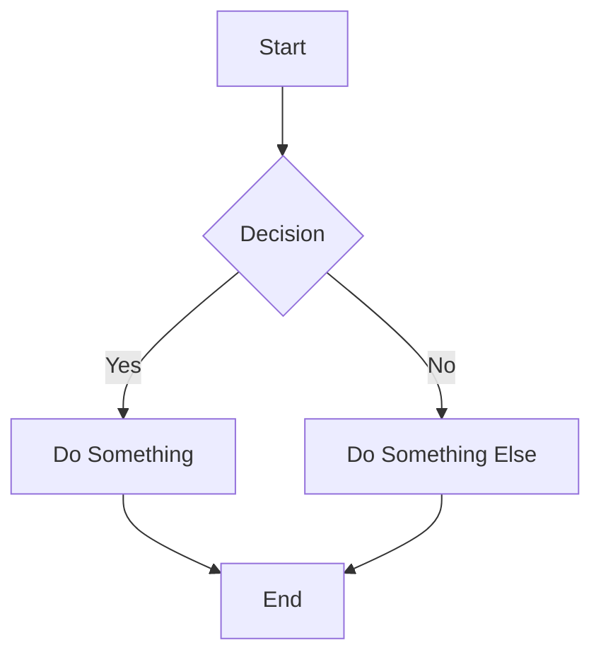
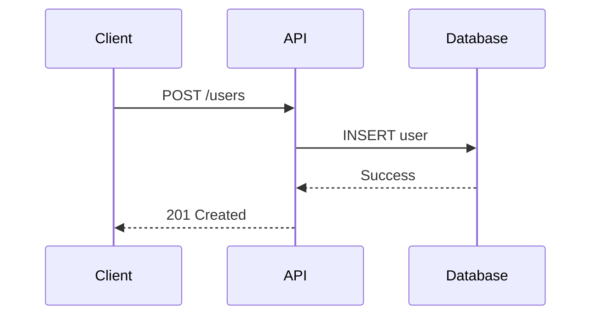

# Documentation.AI — Complete Components Reference

> **Note:** Documentation.AI's component docs (`/docs/components/`) were inaccessible during research (returning 404 / not indexed). This reference is compiled from the sidebar structure you shared, platform documentation, and Documentation.AI's MDX-based component system (which closely mirrors Mintlify's component library, as Documentation.AI positions itself as the #1 Mintlify & GitBook alternative).

---

## 1. Headings and Text

Standard Markdown headings and inline text formatting.

### Syntax

```mdx
# Heading 1
## Heading 2
### Heading 3
#### Heading 4

Regular paragraph text.

**Bold text**
*Italic text*
***Bold and italic***
~~Strikethrough~~
`inline code`
[Link text](https://example.com)
```

### Key Notes

- **H1** (`#`) is typically the page title (set in frontmatter or auto-generated).
- Use **H2–H4** for section hierarchy within your page.
- Headings automatically generate anchor links for deep-linking.
- Frontmatter metadata at the top of each `.mdx` file controls page title, description, and sidebar behavior:

```yaml
---
title: "Page Title"
description: "A brief description of this page"
sidebarTitle: "Short Title"
icon: "book"
---
```

---

## 2. Lists and Tables

### Unordered Lists

```mdx
- Item one
- Item two
  - Nested item
  - Another nested item
- Item three
```

### Ordered Lists

```mdx
1. First step
2. Second step
3. Third step
```

### Tables

```mdx
| Column 1 | Column 2 | Column 3 |
| -------- | -------- | -------- |
| Cell A   | Cell B   | Cell C   |
| Cell D   | Cell E   | Cell F   |
```

### Key Notes

- Tables support standard Markdown alignment (`:---`, `:---:`, `---:`).
- For complex data, consider using the `<ResponseField>` or `<ParamField>` components instead of raw tables.

---

## 3. Card

A styled container for linking to other pages or highlighting content.

### Syntax

```mdx
<Card title="Card Title" icon="rocket" href="/docs/getting-started">
  A brief description of what this card links to or describes.
</Card>
```

### Props

| Prop    | Type   | Description                                        |
| ------- | ------ | -------------------------------------------------- |
| `title` | string | **Required.** Title displayed on the card          |
| `icon`  | string | Icon name (from icon library, e.g., Font Awesome)  |
| `href`  | string | URL the card links to (internal or external)       |
| `img`   | string | Optional image URL to display in the card          |

### CardGroup

Cards are often wrapped in a `<CardGroup>` to display in a grid layout:

```mdx
<CardGroup cols={2}>
  <Card title="Quickstart" icon="bolt" href="/quickstart">
    Get up and running in 5 minutes.
  </Card>
  <Card title="API Reference" icon="code" href="/api-reference">
    Explore the full API documentation.
  </Card>
  <Card title="Tutorials" icon="graduation-cap" href="/tutorials">
    Step-by-step guides for common tasks.
  </Card>
  <Card title="FAQ" icon="question" href="/faq">
    Answers to frequently asked questions.
  </Card>
</CardGroup>
```

| Prop   | Type   | Description                          |
| ------ | ------ | ------------------------------------ |
| `cols` | number | Number of columns (1, 2, 3, or 4)   |

---

## 4. Columns

Split content into multi-column layouts.

### Syntax

```mdx
<Columns>
  <Column>
    Content in the **left** column.
  </Column>
  <Column>
    Content in the **right** column.
  </Column>
</Columns>
```

### Key Notes

- Supports 2 or 3 columns.
- Columns stack vertically on mobile/narrow screens.
- You can place any MDX content inside each `<Column>`, including code blocks, images, and other components.

---

## 5. Images

### Standard Markdown Image

```mdx

```

### MDX Image Component (with advanced options)

```mdx

```

### Frame Component

Wraps an image with a styled border/shadow for a polished look:

```mdx
<Frame>
  
</Frame>
```

### Props (Frame)

| Prop      | Type   | Description                              |
| --------- | ------ | ---------------------------------------- |
| `caption` | string | Optional caption displayed below image   |

### Key Notes

- Images can be placed in a `/images` or `/assets` directory in your docs repo.
- Use descriptive `alt` text for accessibility and AI readability.
- Supported formats: PNG, JPG, SVG, GIF, WebP.

---

## 6. Videos and Iframes

### Embed a Video

```mdx
<iframe
  src="https://www.youtube.com/embed/VIDEO_ID"
  title="Video Title"
  width="100%"
  height="400"
  frameBorder="0"
  allow="accelerometer; autoplay; clipboard-write; encrypted-media; gyroscope"
  allowFullScreen
/>
```

### Dedicated Video Component (if available)

```mdx
<Video src="https://www.youtube.com/embed/VIDEO_ID" />
```

### Key Notes

- Supports YouTube, Vimeo, Loom, and any iframe-embeddable content.
- iframes are sandboxed for security.
- Use `width="100%"` for responsive behavior.

---

## 7. Code and Groups

### Single Code Block

````mdx
```python
def hello():
    print("Hello, world!")
```
````

Specify the language after the triple backticks for syntax highlighting.

### Code Group (Tabbed Code Blocks)

Display multiple code examples in tabs (e.g., different languages or package managers):

````mdx
<CodeGroup>

```bash npm
npm install my-package
```

```bash yarn
yarn add my-package
```

```bash pnpm
pnpm add my-package
```

</CodeGroup>
````

### Props / Features

| Feature          | Description                                              |
| ---------------- | -------------------------------------------------------- |
| Language tag      | After ``` for syntax highlighting (`python`, `js`, etc.) |
| Tab title         | Text after the language tag becomes the tab label        |
| Line highlighting | Some platforms support `{1,3-5}` to highlight lines      |
| Copy button       | Automatically added to all code blocks                   |

---

## 8. Mermaid Diagrams

Render diagrams using Mermaid.js syntax directly in your docs.

### Syntax

````mdx

````

### Supported Diagram Types

- **Flowcharts** (`graph TD`, `graph LR`)
- **Sequence diagrams** (`sequenceDiagram`)
- **Class diagrams** (`classDiagram`)
- **State diagrams** (`stateDiagram-v2`)
- **ER diagrams** (`erDiagram`)
- **Gantt charts** (`gantt`)
- **Pie charts** (`pie`)
- **Git graphs** (`gitGraph`)

### Example: Sequence Diagram

````mdx

````

---

## 9. Callout

Highlighted boxes for tips, warnings, notes, and important information.

### Syntax

```mdx
<Note>
  This is a general informational note.
</Note>

<Tip>
  This is a helpful tip or best practice.
</Tip>

<Warning>
  This is a warning about potential issues.
</Warning>

<Info>
  This is general information.
</Info>

<Check>
  This indicates a success or completed state.
</Check>
```

### Alternative Syntax (Admonition-style)

Some platforms also support:

```mdx
<Callout type="info" title="Custom Title">
  Content of the callout with a custom title.
</Callout>
```

### Props

| Prop    | Type   | Values                                          |
| ------- | ------ | ----------------------------------------------- |
| `type`  | string | `note`, `tip`, `warning`, `info`, `check`       |
| `title` | string | Optional custom title (overrides default)        |

---

## 10. Expandables (Accordions)

Collapsible sections that hide content behind a clickable header.

### Syntax

```mdx
<Expandable title="Click to expand">
  Hidden content that appears when the user clicks.
  
  You can include **any MDX content** here, including code blocks,
  images, and other components.
</Expandable>
```

### Accordion Group

Group multiple expandables together:

```mdx
<AccordionGroup>
  <Expandable title="Question 1">
    Answer to question 1.
  </Expandable>
  <Expandable title="Question 2">
    Answer to question 2.
  </Expandable>
  <Expandable title="Question 3">
    Answer to question 3.
  </Expandable>
</AccordionGroup>
```

### Props

| Prop          | Type    | Description                                  |
| ------------- | ------- | -------------------------------------------- |
| `title`       | string  | **Required.** Header text shown when collapsed |
| `defaultOpen` | boolean | Whether the section starts expanded           |

---

## 11. Steps

Display a numbered, step-by-step process with visual connectors.

### Syntax

```mdx
<Steps>
  <Step title="Install the SDK">
    Run the following command to install:
    ```bash
    npm install my-sdk
    ```
  </Step>
  <Step title="Configure your API key">
    Add your API key to the environment:
    ```bash
    export API_KEY="your-key-here"
    ```
  </Step>
  <Step title="Make your first request">
    ```python
    import my_sdk
    client = my_sdk.Client()
    response = client.hello()
    print(response)
    ```
  </Step>
</Steps>
```

### Props

| Prop        | Type   | Description                                     |
| ----------- | ------ | ----------------------------------------------- |
| `title`     | string | **Required.** Title for the step                |
| `icon`      | string | Optional icon for the step                      |
| `titleSize` | string | Size of title text (`h2`, `h3`, `h4`)            |

---

## 12. Tabs

Display content in switchable tabs.

### Syntax

```mdx
<Tabs>
  <Tab title="Node.js">
    ```javascript
    const axios = require('axios');
    const response = await axios.get('/api/data');
    ```
  </Tab>
  <Tab title="Python">
    ```python
    import requests
    response = requests.get('/api/data')
    ```
  </Tab>
  <Tab title="cURL">
    ```bash
    curl -X GET https://api.example.com/data
    ```
  </Tab>
</Tabs>
```

### Props

| Prop    | Type   | Description                            |
| ------- | ------ | -------------------------------------- |
| `title` | string | **Required.** Label shown on the tab   |

### Key Notes

- Place any MDX content inside each `<Tab>`.
- Tab selection can persist across the page (synced tabs).
- Useful for showing the same concept in multiple languages or frameworks.

---

## 13. Update

Display changelog entries or product updates with timestamps.

### Syntax

```mdx
<Update label="v2.1.0" date="2026-02-15">
  ### New Features
  - Added dark mode support
  - Improved search performance

  ### Bug Fixes
  - Fixed pagination issue on mobile
</Update>
```

### Props

| Prop    | Type   | Description                                |
| ------- | ------ | ------------------------------------------ |
| `label` | string | Version number or update label             |
| `date`  | string | Date of the update (e.g., `2026-02-15`)    |

---

## 14. Param Field

Document API request parameters with structured, interactive fields. Commonly used inside API reference pages.

### Syntax

```mdx
<ParamField path="user_id" type="string" required>
  The unique identifier of the user.
</ParamField>

<ParamField path="email" type="string" required>
  The user's email address. Must be a valid email format.
</ParamField>

<ParamField path="name" type="string">
  The user's display name. Optional.
</ParamField>

<ParamField path="metadata" type="object">
  Additional key-value metadata to attach to the user.

  <Expandable title="Metadata properties">
    <ParamField path="metadata.role" type="string">
      The user's role (e.g., `admin`, `viewer`).
    </ParamField>
    <ParamField path="metadata.team" type="string">
      The team the user belongs to.
    </ParamField>
  </Expandable>
</ParamField>
```

### Props

| Prop          | Type    | Description                                        |
| ------------- | ------- | -------------------------------------------------- |
| `path`        | string  | **Required.** The parameter name/path              |
| `type`        | string  | Data type (`string`, `number`, `boolean`, `object`, `array`) |
| `required`    | boolean | Whether the parameter is required                  |
| `default`     | string  | Default value                                      |
| `placeholder` | string  | Example/placeholder value                          |
| `header`      | boolean | Whether this is a header parameter                 |
| `query`       | boolean | Whether this is a query parameter                  |
| `body`        | boolean | Whether this is a body parameter                   |

### Variants

```mdx
<!-- Header parameter -->
<ParamField header="Authorization" type="string" required>
  Bearer token for authentication.
</ParamField>

<!-- Query parameter -->
<ParamField query="page" type="integer" default="1">
  Page number for pagination.
</ParamField>

<!-- Body parameter -->
<ParamField body="email" type="string" required>
  The email to register.
</ParamField>
```

---

## 15. Response Field

Document API response fields with structured descriptions.

### Syntax

```mdx
<ResponseField name="id" type="string">
  The unique identifier for the created resource.
</ResponseField>

<ResponseField name="status" type="string">
  The current status. One of: `active`, `pending`, `disabled`.
</ResponseField>

<ResponseField name="data" type="object">
  The response data object.

  <Expandable title="Data properties">
    <ResponseField name="data.user" type="object">
      The user object.
    </ResponseField>
    <ResponseField name="data.created_at" type="string">
      ISO 8601 timestamp of creation.
    </ResponseField>
  </Expandable>
</ResponseField>
```

### Props

| Prop      | Type    | Description                                |
| --------- | ------- | ------------------------------------------ |
| `name`    | string  | **Required.** The field name/path          |
| `type`    | string  | Data type of the response field            |
| `required`| boolean | Whether the field is always present         |

---

## 16. API Components

Interactive API playground and endpoint documentation components.

### API Endpoint Definition (via Frontmatter)

```yaml
---
title: "Create User"
api: "POST https://api.example.com/v1/users"
---
```

This automatically generates an interactive API playground with request/response panels.

### Request/Response Examples

```mdx
<RequestExample>
```bash cURL
curl -X POST https://api.example.com/v1/users \
  -H "Authorization: Bearer YOUR_API_KEY" \
  -H "Content-Type: application/json" \
  -d '{
    "email": "user@example.com",
    "name": "John Doe"
  }'
```

```python Python
import requests

response = requests.post(
    "https://api.example.com/v1/users",
    headers={"Authorization": "Bearer YOUR_API_KEY"},
    json={"email": "user@example.com", "name": "John Doe"}
)
```
</RequestExample>

<ResponseExample>
```json 200
{
  "id": "usr_abc123",
  "email": "user@example.com",
  "name": "John Doe",
  "created_at": "2026-02-22T12:00:00Z"
}
```

```json 400
{
  "error": {
    "code": "invalid_email",
    "message": "The email address is not valid."
  }
}
```
</ResponseExample>
```

### API Configuration (in `docs.json` or equivalent config)

```json
{
  "api": {
    "baseUrl": "https://api.example.com",
    "auth": {
      "method": "bearer",
      "name": "Authorization"
    },
    "playground": {
      "mode": "simple"
    }
  }
}
```

### Key Features

- **Interactive playground:** Users can test endpoints directly from the docs.
- **Auto-generated code snippets:** Request examples in multiple languages.
- **Response validation:** Shows expected response schema.
- **Auth handling:** Supports Bearer, API Key, and Basic auth.

---

## 17. Using Cursor

Documentation.AI supports a **docs-as-code** workflow. The "Using Cursor" section guides developers on:

- Opening your docs repo in **Cursor** (AI-powered code editor)
- Using Cursor's AI to draft and edit MDX documentation files
- Leveraging autocompletion for MDX component syntax
- Integrating with Git for version control

### Typical Workflow

1. Clone your Documentation.AI project repo
2. Open it in Cursor
3. Create/edit `.mdx` files in your docs directory
4. Use Cursor's AI to suggest content, fix formatting, and validate components
5. Commit and push — Documentation.AI auto-deploys

---

## 18. Using Claude Code

Similar to the Cursor integration, Documentation.AI provides guidance for using **Claude Code** (Anthropic's terminal-based coding agent) to:

- Generate and update documentation from your codebase
- Use the `CLAUDE.md` file to teach Claude Code about your docs structure
- Leverage MCP (Model Context Protocol) for real-time spec syncing
- Auto-generate API documentation from OpenAPI specs

### Typical Workflow

1. Navigate to your docs repo in terminal
2. Run `claude` to start Claude Code
3. Ask Claude to create, edit, or review your MDX documentation
4. Claude Code reads your codebase and generates accurate docs
5. Review, commit, and deploy

---

## 19. Helpful Prompts

This section typically provides ready-to-use AI prompts for Documentation.AI's built-in AI assistant or external tools. Common prompt categories include:

- **Content generation:** "Write a quickstart guide for [feature]"
- **Improvement:** "Improve the clarity of this API endpoint description"
- **Structure:** "Reorganize this page into a step-by-step tutorial"
- **Review:** "Check this documentation for accuracy and completeness"
- **Translation:** "Translate this page to [language]"
- **Changelog:** "Generate a changelog entry from these Git commits"

---

## Quick Syntax Cheat Sheet

| Component           | Opening Tag                                         |
| ------------------- | --------------------------------------------------- |
| Card                | `<Card title="..." icon="..." href="...">`          |
| CardGroup           | `<CardGroup cols={2}>`                              |
| Tabs                | `<Tabs>` → `<Tab title="...">`                      |
| Steps               | `<Steps>` → `<Step title="...">`                    |
| Callout (Note)      | `<Note>`                                            |
| Callout (Warning)   | `<Warning>`                                         |
| Callout (Tip)       | `<Tip>`                                             |
| Expandable          | `<Expandable title="...">`                          |
| Accordion Group     | `<AccordionGroup>`                                  |
| Columns             | `<Columns>` → `<Column>`                            |
| Code Group          | `<CodeGroup>`                                       |
| Frame (for images)  | `<Frame>`                                           |
| Param Field         | `<ParamField path="..." type="...">`                |
| Response Field      | `<ResponseField name="..." type="...">`             |
| Request Example     | `<RequestExample>`                                  |
| Response Example    | `<ResponseExample>`                                 |
| Update              | `<Update label="..." date="...">`                   |

---

*Generated on February 22, 2026. Verify exact syntax against live Documentation.AI docs once accessible.*